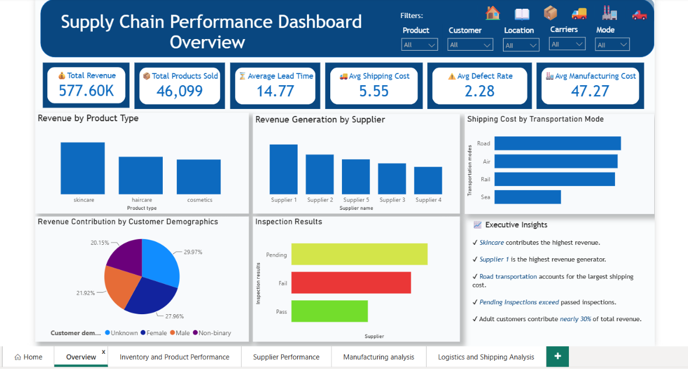
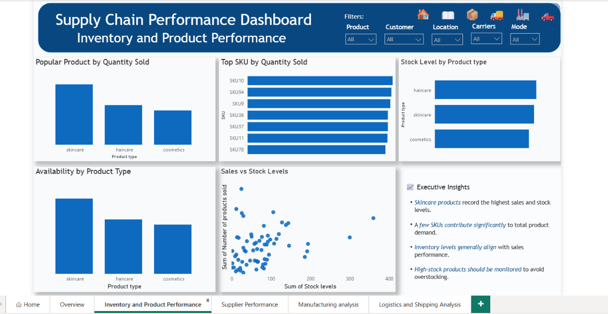
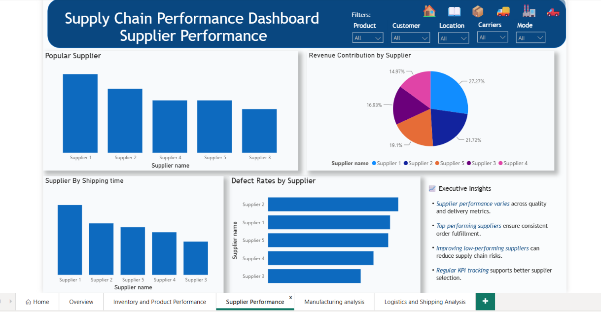
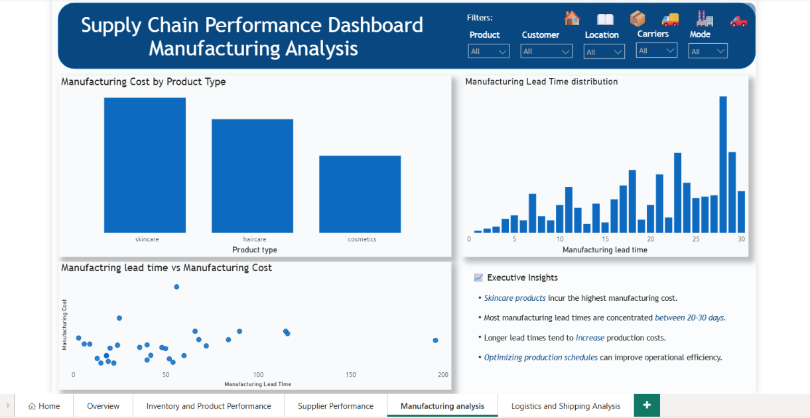
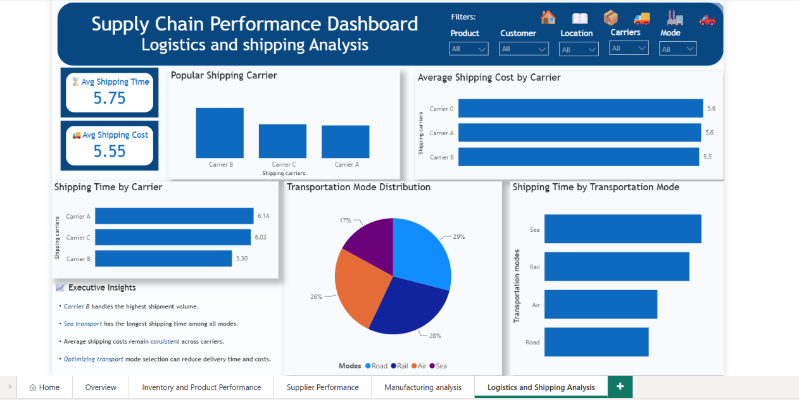

# Supply Chain Performance Dashboard


> **An end-to-end Supply Chain Analytics project that leverages Python and Power BI to transform raw operational data into interactive dashboards, uncover business insights, and support data-driven decision-making across inventory, suppliers, manufacturing, and logistics.**

---

#  Project Overview

Efficient supply chain management is essential for reducing operational costs, improving customer satisfaction, and maximizing profitability.

This project analyzes supply chain operations by integrating Python for data cleaning and exploratory analysis and Power BI for interactive dashboard development. It enables stakeholders to monitor operational KPIs, identify bottlenecks, and make informed business decisions.

---

#  Business Objectives

The project aims to:

- Analyze overall supply chain performance.
- Monitor inventory availability and product demand.
- Evaluate supplier efficiency and reliability.
- Assess manufacturing costs and lead times.
- Examine logistics performance and shipping costs.
- Develop interactive dashboards for executive reporting.
- Generate actionable business recommendations.

---

# Tech Stack

- Python
- Power BI
- Pandas
- NumPy
- Matplotlib
- Power Query
- DAX
- Jupyter Notebook

---

#  Repository Structure

```text
Supply-Chain-Performance-Dashboard
│
├── Dashboard
│   ├── Supply_chain_dashboard.pbix
│   ├── Home_Page.png
│   ├── Overview.png
│   ├── Product.png
│   ├── Supplier.png
│   ├── Manufacturing.png
│   └── Logistics.png
│
├── Python
│   ├── Supply_chain_analysis.ipynb
│   ├── supply_chain_data_cleaned.xlsx
│   
│
│
├── Dataset
│   ├── supply_chain_data_messy.xlsx
│   
│
└── README.md
```

---

#  Project Workflow

```text
Raw Dataset
      │
      ▼
Data Cleaning (Python)
      │
      ▼
Exploratory Data Analysis
      │
      ▼
Power BI Data Modeling
      │
      ▼
Interactive Dashboard
      │
      ▼
Business Insights
      │
      ▼
Strategic Recommendations
```

---

#  Dashboard Pages

## 🏠 Home

A centralized landing page providing project objectives, technologies used, dashboard highlights, and navigation to different analytical sections.

---

## 📈 Executive Overview

Provides a high-level summary of supply chain performance through KPIs and operational metrics.

### KPIs

- Total Revenue
- Total Products Sold
- Average Lead Time
- Average Shipping Cost
- Average Manufacturing Cost
- Average Defect Rate

### Visualizations

- Revenue by Product Type
- Revenue by Supplier
- Shipping Cost by Transportation Mode
- Revenue Contribution by Customer Demographics
- Inspection Results
- Executive Insights

---

## 📦 Inventory & Product Performance

Analyzes inventory levels and product demand.

### Visualizations

- Popular Products by Quantity Sold
- Top Performing SKUs
- Stock Levels by Product Type
- Product Availability
- Sales vs Stock Levels
- Executive Insights

---

## 🚚 Supplier Performance

Evaluates supplier contribution and operational efficiency.

### Visualizations

- Revenue Contribution by Supplier
- Supplier Shipping Time
- Defect Rates by Supplier
- Supplier Performance Comparison
- Executive Insights

---

## 🏭 Manufacturing Analysis

Examines production efficiency and manufacturing operations.

### Visualizations

- Manufacturing Cost by Product Type
- Manufacturing Lead Time Distribution
- Manufacturing Lead Time vs Cost
- Executive Insights

---

## 🚛 Logistics & Shipping Analysis

Provides insights into transportation efficiency and logistics operations.

### KPIs

- Average Shipping Time
- Average Shipping Cost

### Visualizations

- Popular Shipping Carrier
- Shipping Cost by Carrier
- Shipping Time by Carrier
- Transportation Mode Distribution
- Shipping Time by Transportation Mode
- Executive Insights

---

#  Key Business Insights

- Skincare products generate the highest overall revenue.
- Supplier 1 contributes the largest share of revenue among suppliers.
- Road transportation accounts for the highest shipping costs.
- Manufacturing lead times are concentrated between **20–30 days**.
- Carrier B handles the highest shipment volume.
- Product demand closely aligns with inventory availability.
- Supplier performance varies significantly across quality and delivery metrics.
- Longer manufacturing lead times generally increase production costs.

---

# 💡 Business Recommendations

- Optimize inventory levels for high-demand products to reduce stockouts.
- Improve supplier evaluation using quality and defect KPIs.
- Reduce transportation costs by optimizing shipping mode selection.
- Shorten manufacturing lead times through production planning improvements.
- Monitor supplier performance regularly using operational dashboards.
- Improve inspection processes to reduce pending and failed inspections.
- Use predictive inventory planning to minimize excess stock while meeting customer demand.

---

#  Dashboard Preview

##  Home


---

##  Executive Overview



---

##  Inventory & Product Performance



---

##  Supplier Performance



---

##  Manufacturing Analysis



---

##  Logistics & Shipping Analysis



---

#  Skills Demonstrated

- Data Cleaning
- Data Transformation
- Exploratory Data Analysis (EDA)
- Dashboard Design
- Data Modeling
- DAX
- Power Query
- KPI Development
- Business Intelligence
- Supply Chain Analytics
- Inventory Analysis
- Supplier Performance Analysis
- Manufacturing Analytics
- Logistics Analytics
- Data Storytelling

---

#  Business Impact

This project demonstrates how data analytics can improve supply chain visibility by transforming raw operational data into meaningful business intelligence. Through Python, SQL, and Power BI, the dashboard enables organizations to monitor key performance indicators, identify operational bottlenecks, optimize inventory, evaluate suppliers, improve manufacturing efficiency, and streamline logistics for better strategic decision-making.

---

#  Connect With Me

If you found this project helpful or have suggestions for improvement, feel free to connect with me on **LinkedIn** or explore more of my data analytics projects on **GitHub**.

---

## ⭐ If you found this project useful, don't forget to give it a star!
